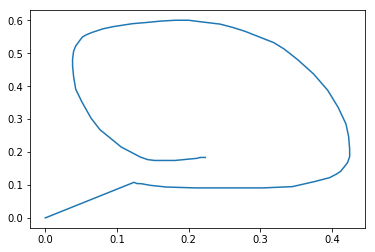
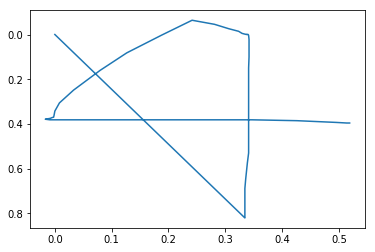
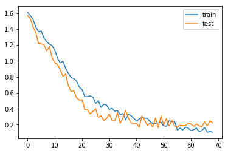

# Welcome !

PyMouseGesture is a project that aims to show how to build a simple Keras RNN model by using the example of interpreting mouse movement as gestures.

## Organization
1. [Collecting data](#Collecting_data)
1. [Cleaning and Structuring data](#Process_data)
1. [Data Visualization](#data_vis)
1. [Training and testing on RNN](#rnn_build)
1. [Training the 1d ConvNet model](#train_cnn)
1. [Live inference !](#Live_Inference)

<a id = "Collecting_data"></a>

## Collecting data


The data was collected using the python library [pynput](https://pypi.org/project/pynput/). The script mouse_data_collector.py is a helper script that is used to collect and label the mouse data simultaneously. However if you exit the script the collected data is written to the data.csv file in the directory overwriting any previous file of the same name.

The logic behind the script is simple:
- create a mouse event listener.
- define methods to be called when mouse is clicked and mouse is moved
- if mouse is moved collect data for the current gesture
- if mouse is clicked stop collecting data for the current gesture.
- ask the user to label the gesture
- save the collected data as a list of x and y co-ordinates


```python
#first let us import the necessary packages and finish setup
import pandas as pd
import numpy as np
import matplotlib.pyplot as plt
#set numpy random seed for reproducible results
np.random.seed(0)

%matplotlib inline
```

<a id = 'Process_data'></a>

## Cleaning and Structuring Data

Let us first read our collected data before doing anything else. We are using [pandas](https://pandas.pydata.org/) to read and manipulate the data.


```python
#read data.csv using pd.read_csv
data = pd.read_csv('data.csv')
print(data.columns)
data.head()
```

    Index(['sequence', 'x_coordinates', 'y_coordinates'], dtype='object')
    


<div>
<style scoped>
    .dataframe tbody tr th:only-of-type {
        vertical-align: middle;
    }

    .dataframe tbody tr th {
        vertical-align: top;
    }

    .dataframe thead th {
        text-align: right;
    }
</style>
<table border="1" class="dataframe">
  <thead>
    <tr style="text-align: right;">
      <th></th>
      <th>sequence</th>
      <th>x_coordinates</th>
      <th>y_coordinates</th>
    </tr>
  </thead>
  <tbody>
    <tr>
      <th>0</th>
      <td>0</td>
      <td>[305, 305, 303, 299, 295, 289, 281, 272, 264, ...</td>
      <td>[141, 141, 141, 141, 141, 139, 138, 137, 136, ...</td>
    </tr>
    <tr>
      <th>1</th>
      <td>0</td>
      <td>[238, 234, 226, 214, 200, 175, 149, 124, 103, ...</td>
      <td>[166, 165, 165, 165, 167, 174, 183, 194, 206, ...</td>
    </tr>
    <tr>
      <th>2</th>
      <td>0</td>
      <td>[162, 157, 146, 134, 102, 69, 17, -37, -66, -5...</td>
      <td>[257, 256, 253, 252, 250, 250, 255, 267, 293, ...</td>
    </tr>
    <tr>
      <th>3</th>
      <td>0</td>
      <td>[239, 237, 234, 230, 223, 212, 199, 181, 162, ...</td>
      <td>[205, 204, 204, 204, 204, 205, 209, 214, 219, ...</td>
    </tr>
    <tr>
      <th>4</th>
      <td>0</td>
      <td>[248, 247, 245, 240, 226, 214, 188, 160, 120, ...</td>
      <td>[221, 220, 219, 218, 217, 215, 214, 214, 214, ...</td>
    </tr>
  </tbody>
</table>
</div>


As we saved our data into a csv file, while reading the file input, the list variables are read as strings. A helper function in the cell below *string_to_list* converts them back to integer lists.


```python
type(data.at[0,'x_coordinates'])
```


    str


```python
def string_to_list(string_list):
    """
    Converts list read from csv as string back into integer list. Returns error if string literal has non numeric characters
    
    Args:
    ----
    string_list - A list of integers read as a string literal
    
    Returns:
    -------
    int_list - A list of integers corresponding to the input string list
    
    ##Example
    z = string_to_list(data.at[0,'x_coordinates']) where data is a pandas DataFrame
        
    """
    return list(map(int,string_list.strip('[]').split(',')))
    


```

We just defined a value of the maximum length of the sequence to be 75. This is obtained by analyzing the lengths of the sequences output from *string_to_list*. 

Also *m* represents the number of training examples. Here it is 101.

Feel free to replace the value of the index in the last line of the cell from 50 to anyother value. You will see values between 60 - 80.


```python
#let maxLen be 120
maxLen = 75
m = data.shape[0]
print(m)
len(string_to_list(data.at[50,'x_coordinates']))
```

    252
    


    73


Now let us create our input and output variables. X will refer to our input variable of shape (2,m,maxLen) and Z will refer to our output variable of shape (m,)

X is initialized as a numpy array of zeros with m rows, 2 columns and depth equal to maxLen
Z is directly assigned values by converting a dataframe column to numpy array


```python
X = np.zeros((m,2,maxLen))
Z = data['sequence'].values
print("The shape of X is ",X.shape)
print("The shape of Z is ",Z.shape)
```

    The shape of X is  (252, 2, 75)
    The shape of Z is  (252,)
    

Before we create store the values in the numpy array, let us scale the data appropriately so that the values lie in the range (0 - 1). I had intended to do this after storing my values in the numpy array. However the appended zeros in the array will be changed to non-zero values which is not a good idea. So I am scaling the data using the minimum and maximum values in the sequence. Another way would be to use domain knowledge such as the minimum and maximum values that pynput can give. However this is not availabe to us.

The system resolution of the test PC is 1366 x 768. However while running a simple program to output the mouse position, coordinates were often negative to the tune of -400 even. But we'll still use 1366 x 768 for the data.csv generated for this PC.

While inference, the scaling should be done using the screen resolution of the pc carrying out the inference. 

Therefore,
1. X_MAX = 1366
1. X_MIN = 0
1. Y_MAX = 768
1. Y_MIN = 0


```python
def max_min_normalize(MAX,MIN,value):
    '''
    args:
    ----
    MAX - maximum value of the data distribution.
    MIN - minimum value of the data distribution.
    value - the value to be normalized.
    
    return:
    ------
    norm_value - the normalized value.
    
    norm_value = ( value - MIN ) / ( MAX - MIN )
        
    '''
    return (value - MIN) / (MAX - MIN)
```

Let's use Python's map function to normalize the sequence before storing it in an array.


```python
X_MAX = 1366
X_MIN = 0
Y_MAX = 768
Y_MIN = 0

for i in range(m):
    x = map(lambda x:max_min_normalize(X_MAX,X_MIN,x),string_to_list(data.at[i,'x_coordinates']))
    y = map(lambda y:max_min_normalize(Y_MAX,Y_MIN,y),string_to_list(data.at[i,'y_coordinates']))
    x = list(x)
    y = list(y)
    if len(x) > maxLen:
        X[i,0,:len(x)] =x[:maxLen]
        X[i,1,:len(y)] =y[:maxLen]
    else:
        X[i,0,:len(x)] =x
        X[i,1,:len(y)] =y
        
```

Let's one hot encode the class labels. Let us now import the keras modules to build our network as well as one hot encode the data.


```python
from keras.models import Model
from keras.layers import Dense,Input,Dropout,LSTM,Activation
from keras.initializers import glorot_uniform
from keras.utils import to_categorical
```

    Using TensorFlow backend.
    


```python
print(Z.shape)
Z = to_categorical(Z,5)
print(Z.shape)
```

    (252,)
    (252, 5)
    

## Training the RNN model <a id = 'rnn_build'></a>


```python
def MouseClassify(input_shape):
    X_Input = Input(shape = input_shape,dtype=np.float32)
    X = LSTM(256,return_sequences=True)(X_Input)
    X = Dropout(0.5)(X)
    X = LSTM(128,return_sequences=False)(X)
    X = Dropout(0.5)(X)
    X = Dense(32)(X)
    X = Dense(5)(X)
    X = Activation('softmax')(X)
    model = Model(X_Input,X)
    
    return model

```


```python
model_0 = MouseClassify((75,2))
model_0.compile(loss='categorical_crossentropy',optimizer='sgd',metrics=['accuracy'])
```


```python
model_0.fit(x=np.swapaxes(X,1,2),y=Z,batch_size=25,epochs=15)
model_0.summary()
```

    Epoch 1/15
    252/252 [==============================] - 13s 51ms/step - loss: 1.6128 - acc: 0.1627
    Epoch 2/15
    252/252 [==============================] - 8s 33ms/step - loss: 1.6131 - acc: 0.1825
    Epoch 3/15
    252/252 [==============================] - 10s 40ms/step - loss: 1.6132 - acc: 0.1825
    Epoch 4/15
    252/252 [==============================] - 14s 54ms/step - loss: 1.6120 - acc: 0.1548
    Epoch 5/15
    252/252 [==============================] - 11s 44ms/step - loss: 1.6125 - acc: 0.1786
    Epoch 6/15
    252/252 [==============================] - 8s 32ms/step - loss: 1.6125 - acc: 0.2024
    Epoch 7/15
    252/252 [==============================] - 11s 46ms/step - loss: 1.6108 - acc: 0.1627
    Epoch 8/15
    252/252 [==============================] - 12s 48ms/step - loss: 1.6112 - acc: 0.2063
    Epoch 9/15
    252/252 [==============================] - 11s 45ms/step - loss: 1.6121 - acc: 0.1786
    Epoch 10/15
    252/252 [==============================] - 13s 51ms/step - loss: 1.6099 - acc: 0.1905
    Epoch 11/15
    252/252 [==============================] - 12s 49ms/step - loss: 1.6119 - acc: 0.2024
    Epoch 12/15
    252/252 [==============================] - 14s 54ms/step - loss: 1.6105 - acc: 0.2024
    Epoch 13/15
    252/252 [==============================] - 15s 60ms/step - loss: 1.6094 - acc: 0.2063
    Epoch 14/15
    252/252 [==============================] - 14s 54ms/step - loss: 1.6100 - acc: 0.2262
    Epoch 15/15
    252/252 [==============================] - 13s 51ms/step - loss: 1.6090 - acc: 0.2222
    _________________________________________________________________
    Layer (type)                 Output Shape              Param #   
    =================================================================
    input_3 (InputLayer)         (None, 75, 2)             0         
    _________________________________________________________________
    lstm_3 (LSTM)                (None, 75, 256)           265216    
    _________________________________________________________________
    dropout_4 (Dropout)          (None, 75, 256)           0         
    _________________________________________________________________
    lstm_4 (LSTM)                (None, 128)               197120    
    _________________________________________________________________
    dropout_5 (Dropout)          (None, 128)               0         
    _________________________________________________________________
    dense_5 (Dense)              (None, 32)                4128      
    _________________________________________________________________
    dense_6 (Dense)              (None, 5)                 165       
    _________________________________________________________________
    activation_2 (Activation)    (None, 5)                 0         
    =================================================================
    Total params: 466,629
    Trainable params: 466,629
    Non-trainable params: 0
    _________________________________________________________________
    


```python
print(model_0.predict(np.swapaxes(X[0:1],1,2),verbose=1))
Z[0:1]
```

    1/1 [==============================] - 1s 957ms/step
    [[0.20926528 0.18991499 0.2031836  0.19273911 0.20489705]]
    


    array([[1., 0., 0., 0., 0.]], dtype=float32)


```python
plt.plot(X[0,0,:],X[0,1,:])
```


    [<matplotlib.lines.Line2D at 0x1de8d5e34a8>]





Obvioulsy the model has failed to learn anything. The model is as good as randomly guessing the class labels. So its useless. Let us try a one dimensional CNN.

## Training the 1D ConvNet <a id = 'train_cnn'></a> 


```python
from keras.layers import Conv1D, GlobalAveragePooling1D, MaxPooling1D
from sklearn.model_selection import train_test_split
from keras.callbacks import EarlyStopping,ModelCheckpoint
```


```python
def CNNMouseClassify(input_shape):
    X_input = Input(input_shape,dtype=np.float32)
    #Sequence classifier example on Keras website
    X = Conv1D(64,3,activation='relu')(X_input)
    X = Conv1D(64,3,activation='relu')(X)
    X = MaxPooling1D(3)(X)
    X = Conv1D(128,3,activation='relu')(X)
    X = Conv1D(128,3,activation='relu')(X)
    X = GlobalAveragePooling1D()(X)
    X = Dropout(0.5)(X)
    X = Dense(32)(X)
    X = Dense(5,activation='softmax')(X)
    return Model(X_input,X)
```


```python
X_train, X_test, y_train, y_test = train_test_split(X,Z,test_size = 0.25)
X_train.shape
```


    (189, 2, 75)


```python
model = CNNMouseClassify((75,2))
model.compile(loss='categorical_crossentropy',optimizer='adam',metrics=['accuracy'])
```


```python
#configure callbacks
es = EarlyStopping(monitor='val_loss',verbose=1,patience=20)
mc = ModelCheckpoint('best_model.h5', monitor='val_loss', verbose = 1,mode='min', save_best_only=True)
```

Why not use validation accuracy? The main reason is that accuracy is a coarse measure of model performance during training and that loss provides more nuance when using early stopping with classification problems.


```python
history = model.fit(x=np.swapaxes(X_train,1,2),y=y_train,batch_size=25,epochs=100,validation_data=(np.swapaxes(X_test,1,2),y_test),callbacks=[es,mc])
```

    Train on 189 samples, validate on 63 samples
    Epoch 1/100
    189/189 [==============================] - 16s 84ms/step - loss: 1.6105 - acc: 0.1799 - val_loss: 1.5707 - val_acc: 0.2222
    
    Epoch 00001: val_loss improved from inf to 1.57066, saving model to best_model.h5
    Epoch 2/100
    189/189 [==============================] - 12s 65ms/step - loss: 1.5688 - acc: 0.2804 - val_loss: 1.5298 - val_acc: 0.5714
    
    Epoch 00002: val_loss improved from 1.57066 to 1.52980, saving model to best_model.h5
    Epoch 3/100
    189/189 [==============================] - 10s 55ms/step - loss: 1.5215 - acc: 0.4074 - val_loss: 1.4252 - val_acc: 0.5079
    
    Epoch 00003: val_loss improved from 1.52980 to 1.42523, saving model to best_model.h5
    Epoch 4/100
    189/189 [==============================] - 12s 61ms/step - loss: 1.4253 - acc: 0.4974 - val_loss: 1.3564 - val_acc: 0.7460
    
    Epoch 00004: val_loss improved from 1.42523 to 1.35640, saving model to best_model.h5
    Epoch 5/100
    189/189 [==============================] - 12s 66ms/step - loss: 1.3683 - acc: 0.5132 - val_loss: 1.2229 - val_acc: 0.5397
    
    Epoch 00005: val_loss improved from 1.35640 to 1.22293, saving model to best_model.h5
    Epoch 6/100
    189/189 [==============================] - 12s 65ms/step - loss: 1.3751 - acc: 0.4497 - val_loss: 1.2152 - val_acc: 0.6508
    
    Epoch 00006: val_loss improved from 1.22293 to 1.21525, saving model to best_model.h5
    Epoch 7/100
    189/189 [==============================] - 12s 64ms/step - loss: 1.2889 - acc: 0.5132 - val_loss: 1.2065 - val_acc: 0.5556
    
    Epoch 00007: val_loss improved from 1.21525 to 1.20649, saving model to best_model.h5
    Epoch 8/100
    189/189 [==============================] - 12s 62ms/step - loss: 1.2416 - acc: 0.5026 - val_loss: 1.1271 - val_acc: 0.6825
    
    Epoch 00008: val_loss improved from 1.20649 to 1.12714, saving model to best_model.h5
    Epoch 9/100
    189/189 [==============================] - 11s 60ms/step - loss: 1.2126 - acc: 0.5344 - val_loss: 1.1819 - val_acc: 0.4762
    
    Epoch 00009: val_loss did not improve from 1.12714
    Epoch 10/100
    189/189 [==============================] - 11s 61ms/step - loss: 1.1933 - acc: 0.5661 - val_loss: 1.0388 - val_acc: 0.7619
    
    Epoch 00010: val_loss improved from 1.12714 to 1.03883, saving model to best_model.h5
    Epoch 11/100
    189/189 [==============================] - 10s 55ms/step - loss: 1.1324 - acc: 0.6243 - val_loss: 0.9758 - val_acc: 0.7460
    
    Epoch 00011: val_loss improved from 1.03883 to 0.97578, saving model to best_model.h5
    Epoch 12/100
    189/189 [==============================] - 10s 54ms/step - loss: 1.0346 - acc: 0.6720 - val_loss: 0.9547 - val_acc: 0.7302
    
    Epoch 00012: val_loss improved from 0.97578 to 0.95473, saving model to best_model.h5
    Epoch 13/100
    189/189 [==============================] - 11s 60ms/step - loss: 0.9741 - acc: 0.6667 - val_loss: 0.8884 - val_acc: 0.7937
    
    Epoch 00013: val_loss improved from 0.95473 to 0.88844, saving model to best_model.h5
    Epoch 14/100
    189/189 [==============================] - 12s 64ms/step - loss: 0.9971 - acc: 0.6614 - val_loss: 0.8044 - val_acc: 0.7778
    
    Epoch 00014: val_loss improved from 0.88844 to 0.80443, saving model to best_model.h5
    Epoch 15/100
    189/189 [==============================] - 11s 58ms/step - loss: 0.9044 - acc: 0.6878 - val_loss: 0.8371 - val_acc: 0.7143
    
    Epoch 00015: val_loss did not improve from 0.80443
    Epoch 16/100
    189/189 [==============================] - 11s 60ms/step - loss: 0.8447 - acc: 0.6614 - val_loss: 0.6870 - val_acc: 0.8254
    
    Epoch 00016: val_loss improved from 0.80443 to 0.68696, saving model to best_model.h5
    Epoch 17/100
    189/189 [==============================] - 11s 60ms/step - loss: 0.7920 - acc: 0.7513 - val_loss: 0.6147 - val_acc: 0.8095
    
    Epoch 00017: val_loss improved from 0.68696 to 0.61473, saving model to best_model.h5
    Epoch 18/100
    189/189 [==============================] - 10s 54ms/step - loss: 0.7786 - acc: 0.7407 - val_loss: 0.6272 - val_acc: 0.8095
    
    Epoch 00018: val_loss did not improve from 0.61473
    Epoch 19/100
    189/189 [==============================] - 10s 53ms/step - loss: 0.7478 - acc: 0.7513 - val_loss: 0.5369 - val_acc: 0.8730
    
    Epoch 00019: val_loss improved from 0.61473 to 0.53693, saving model to best_model.h5
    Epoch 20/100
    189/189 [==============================] - 10s 55ms/step - loss: 0.6708 - acc: 0.7672 - val_loss: 0.5081 - val_acc: 0.8889
    
    Epoch 00020: val_loss improved from 0.53693 to 0.50813, saving model to best_model.h5
    Epoch 21/100
    189/189 [==============================] - 10s 55ms/step - loss: 0.6399 - acc: 0.7672 - val_loss: 0.5140 - val_acc: 0.8413
    
    Epoch 00021: val_loss did not improve from 0.50813
    Epoch 22/100
    189/189 [==============================] - 11s 60ms/step - loss: 0.5524 - acc: 0.8360 - val_loss: 0.3898 - val_acc: 0.9206
    
    Epoch 00022: val_loss improved from 0.50813 to 0.38982, saving model to best_model.h5
    Epoch 23/100
    189/189 [==============================] - 10s 51ms/step - loss: 0.5530 - acc: 0.8466 - val_loss: 0.3873 - val_acc: 0.8889
    
    Epoch 00023: val_loss improved from 0.38982 to 0.38729, saving model to best_model.h5
    Epoch 24/100
    189/189 [==============================] - 9s 49ms/step - loss: 0.5628 - acc: 0.8254 - val_loss: 0.3343 - val_acc: 0.9365
    
    Epoch 00024: val_loss improved from 0.38729 to 0.33430, saving model to best_model.h5
    Epoch 25/100
    189/189 [==============================] - 10s 51ms/step - loss: 0.5468 - acc: 0.8466 - val_loss: 0.3675 - val_acc: 0.9206
    
    Epoch 00025: val_loss did not improve from 0.33430
    Epoch 26/100
    189/189 [==============================] - 9s 49ms/step - loss: 0.4677 - acc: 0.8519 - val_loss: 0.3989 - val_acc: 0.8730
    
    Epoch 00026: val_loss did not improve from 0.33430
    Epoch 27/100
    189/189 [==============================] - 9s 48ms/step - loss: 0.5006 - acc: 0.8466 - val_loss: 0.2942 - val_acc: 0.9365
    
    Epoch 00027: val_loss improved from 0.33430 to 0.29417, saving model to best_model.h5
    Epoch 28/100
    189/189 [==============================] - 10s 52ms/step - loss: 0.4166 - acc: 0.8730 - val_loss: 0.3117 - val_acc: 0.9206
    
    Epoch 00028: val_loss did not improve from 0.29417
    Epoch 29/100
    189/189 [==============================] - 9s 48ms/step - loss: 0.4575 - acc: 0.8413 - val_loss: 0.2529 - val_acc: 0.9524
    
    Epoch 00029: val_loss improved from 0.29417 to 0.25288, saving model to best_model.h5
    Epoch 30/100
    189/189 [==============================] - 9s 49ms/step - loss: 0.4470 - acc: 0.8571 - val_loss: 0.2782 - val_acc: 0.9365
    
    Epoch 00030: val_loss did not improve from 0.25288
    Epoch 31/100
    189/189 [==============================] - 9s 50ms/step - loss: 0.3920 - acc: 0.8889 - val_loss: 0.3360 - val_acc: 0.9048
    
    Epoch 00031: val_loss did not improve from 0.25288
    Epoch 32/100
    189/189 [==============================] - 9s 50ms/step - loss: 0.4065 - acc: 0.8677 - val_loss: 0.2526 - val_acc: 0.9365
    
    Epoch 00032: val_loss improved from 0.25288 to 0.25262, saving model to best_model.h5
    Epoch 33/100
    189/189 [==============================] - 9s 48ms/step - loss: 0.3700 - acc: 0.8836 - val_loss: 0.2443 - val_acc: 0.9524
    
    Epoch 00033: val_loss improved from 0.25262 to 0.24434, saving model to best_model.h5
    Epoch 34/100
    189/189 [==============================] - 9s 49ms/step - loss: 0.3787 - acc: 0.8730 - val_loss: 0.3525 - val_acc: 0.8889
    
    Epoch 00034: val_loss did not improve from 0.24434
    Epoch 35/100
    189/189 [==============================] - 10s 51ms/step - loss: 0.3254 - acc: 0.8889 - val_loss: 0.2199 - val_acc: 0.9524
    
    Epoch 00035: val_loss improved from 0.24434 to 0.21993, saving model to best_model.h5
    Epoch 36/100
    189/189 [==============================] - 10s 51ms/step - loss: 0.3402 - acc: 0.8942 - val_loss: 0.2822 - val_acc: 0.9048
    
    Epoch 00036: val_loss did not improve from 0.21993
    Epoch 37/100
    189/189 [==============================] - 9s 50ms/step - loss: 0.2646 - acc: 0.9259 - val_loss: 0.3795 - val_acc: 0.8889
    
    Epoch 00037: val_loss did not improve from 0.21993
    Epoch 38/100
    189/189 [==============================] - 10s 53ms/step - loss: 0.3304 - acc: 0.9153 - val_loss: 0.2860 - val_acc: 0.9048
    
    Epoch 00038: val_loss did not improve from 0.21993
    Epoch 39/100
    189/189 [==============================] - 9s 49ms/step - loss: 0.3129 - acc: 0.8889 - val_loss: 0.2269 - val_acc: 0.9365
    
    Epoch 00039: val_loss did not improve from 0.21993
    Epoch 40/100
    189/189 [==============================] - 9s 50ms/step - loss: 0.2815 - acc: 0.8942 - val_loss: 0.2106 - val_acc: 0.9365
    
    Epoch 00040: val_loss improved from 0.21993 to 0.21061, saving model to best_model.h5
    Epoch 41/100
    189/189 [==============================] - 10s 51ms/step - loss: 0.2454 - acc: 0.9153 - val_loss: 0.2151 - val_acc: 0.9365
    
    Epoch 00041: val_loss did not improve from 0.21061
    Epoch 42/100
    189/189 [==============================] - 9s 50ms/step - loss: 0.2726 - acc: 0.9101 - val_loss: 0.1686 - val_acc: 0.9683
    
    Epoch 00042: val_loss improved from 0.21061 to 0.16859, saving model to best_model.h5
    Epoch 43/100
    189/189 [==============================] - 10s 51ms/step - loss: 0.2922 - acc: 0.9048 - val_loss: 0.3083 - val_acc: 0.9206
    
    Epoch 00043: val_loss did not improve from 0.16859
    Epoch 44/100
    189/189 [==============================] - 10s 50ms/step - loss: 0.2814 - acc: 0.9101 - val_loss: 0.2523 - val_acc: 0.9365
    
    Epoch 00044: val_loss did not improve from 0.16859
    Epoch 45/100
    189/189 [==============================] - 10s 51ms/step - loss: 0.2824 - acc: 0.9153 - val_loss: 0.1912 - val_acc: 0.9683
    
    Epoch 00045: val_loss did not improve from 0.16859
    Epoch 46/100
    189/189 [==============================] - 9s 49ms/step - loss: 0.2372 - acc: 0.9365 - val_loss: 0.2189 - val_acc: 0.9365
    
    Epoch 00046: val_loss did not improve from 0.16859
    Epoch 47/100
    189/189 [==============================] - 10s 51ms/step - loss: 0.2135 - acc: 0.9312 - val_loss: 0.1713 - val_acc: 0.9524
    
    Epoch 00047: val_loss did not improve from 0.16859
    Epoch 48/100
    189/189 [==============================] - 9s 49ms/step - loss: 0.2161 - acc: 0.9471 - val_loss: 0.2850 - val_acc: 0.9048
    
    Epoch 00048: val_loss did not improve from 0.16859
    Epoch 49/100
    189/189 [==============================] - 10s 51ms/step - loss: 0.2214 - acc: 0.9418 - val_loss: 0.1616 - val_acc: 0.9683
    
    Epoch 00049: val_loss improved from 0.16859 to 0.16159, saving model to best_model.h5
    Epoch 50/100
    189/189 [==============================] - 9s 49ms/step - loss: 0.2329 - acc: 0.9365 - val_loss: 0.3115 - val_acc: 0.8889
    
    Epoch 00050: val_loss did not improve from 0.16159
    Epoch 51/100
    189/189 [==============================] - 10s 51ms/step - loss: 0.1851 - acc: 0.9259 - val_loss: 0.1974 - val_acc: 0.9524
    
    Epoch 00051: val_loss did not improve from 0.16159
    Epoch 52/100
    189/189 [==============================] - 9s 50ms/step - loss: 0.1792 - acc: 0.9577 - val_loss: 0.2743 - val_acc: 0.9206
    
    Epoch 00052: val_loss did not improve from 0.16159
    Epoch 53/100
    189/189 [==============================] - 10s 54ms/step - loss: 0.2511 - acc: 0.9365 - val_loss: 0.1814 - val_acc: 0.9524
    
    Epoch 00053: val_loss did not improve from 0.16159
    Epoch 54/100
    189/189 [==============================] - 11s 56ms/step - loss: 0.2360 - acc: 0.9153 - val_loss: 0.2559 - val_acc: 0.9048
    
    Epoch 00054: val_loss did not improve from 0.16159
    Epoch 55/100
    189/189 [==============================] - 11s 56ms/step - loss: 0.2451 - acc: 0.9312 - val_loss: 0.1831 - val_acc: 0.9524
    
    Epoch 00055: val_loss did not improve from 0.16159
    Epoch 56/100
    189/189 [==============================] - 10s 52ms/step - loss: 0.1333 - acc: 0.9630 - val_loss: 0.1680 - val_acc: 0.9683
    
    Epoch 00056: val_loss did not improve from 0.16159
    Epoch 57/100
    189/189 [==============================] - 12s 63ms/step - loss: 0.1566 - acc: 0.9630 - val_loss: 0.1942 - val_acc: 0.9524
    
    Epoch 00057: val_loss did not improve from 0.16159
    Epoch 58/100
    189/189 [==============================] - 11s 60ms/step - loss: 0.1340 - acc: 0.9577 - val_loss: 0.1885 - val_acc: 0.9683
    
    Epoch 00058: val_loss did not improve from 0.16159
    Epoch 59/100
    189/189 [==============================] - 11s 60ms/step - loss: 0.1680 - acc: 0.9471 - val_loss: 0.1889 - val_acc: 0.9524
    
    Epoch 00059: val_loss did not improve from 0.16159
    Epoch 60/100
    189/189 [==============================] - 12s 63ms/step - loss: 0.1595 - acc: 0.9524 - val_loss: 0.2168 - val_acc: 0.9524
    
    Epoch 00060: val_loss did not improve from 0.16159
    Epoch 61/100
    189/189 [==============================] - 11s 60ms/step - loss: 0.1229 - acc: 0.9577 - val_loss: 0.2083 - val_acc: 0.9524
    
    Epoch 00061: val_loss did not improve from 0.16159
    Epoch 62/100
    189/189 [==============================] - 13s 67ms/step - loss: 0.1370 - acc: 0.9577 - val_loss: 0.1798 - val_acc: 0.9365
    
    Epoch 00062: val_loss did not improve from 0.16159
    Epoch 63/100
    189/189 [==============================] - 11s 58ms/step - loss: 0.1582 - acc: 0.9418 - val_loss: 0.2089 - val_acc: 0.9524
    
    Epoch 00063: val_loss did not improve from 0.16159
    Epoch 64/100
    189/189 [==============================] - 10s 54ms/step - loss: 0.1138 - acc: 0.9683 - val_loss: 0.1873 - val_acc: 0.9683
    
    Epoch 00064: val_loss did not improve from 0.16159
    Epoch 65/100
    189/189 [==============================] - 12s 65ms/step - loss: 0.1250 - acc: 0.9577 - val_loss: 0.1739 - val_acc: 0.9683
    
    Epoch 00065: val_loss did not improve from 0.16159
    Epoch 66/100
    189/189 [==============================] - 12s 65ms/step - loss: 0.1641 - acc: 0.9524 - val_loss: 0.2339 - val_acc: 0.9206
    
    Epoch 00066: val_loss did not improve from 0.16159
    Epoch 67/100
    189/189 [==============================] - 12s 64ms/step - loss: 0.1049 - acc: 0.9735 - val_loss: 0.1821 - val_acc: 0.9683
    
    Epoch 00067: val_loss did not improve from 0.16159
    Epoch 68/100
    189/189 [==============================] - 11s 60ms/step - loss: 0.1139 - acc: 0.9577 - val_loss: 0.2466 - val_acc: 0.9206
    
    Epoch 00068: val_loss did not improve from 0.16159
    Epoch 69/100
    189/189 [==============================] - 12s 62ms/step - loss: 0.1060 - acc: 0.9630 - val_loss: 0.2220 - val_acc: 0.9365
    
    Epoch 00069: val_loss did not improve from 0.16159
    Epoch 00069: early stopping
    


```python
np.swapaxes(X,1,2).shape
```


    (252, 75, 2)


```python
print(model.predict(np.swapaxes(X[0:1],1,2),verbose=1))
Z[0:1]
```

    1/1 [==============================] - 1s 943ms/step
    [[9.9739033e-01 2.3483699e-06 1.4757680e-03 1.6244283e-06 1.1299369e-03]]
    


    array([[1., 0., 0., 0., 0.]], dtype=float32)


## Live Inference <a id = 'Live_Inference' ></a> 


```python
from pynput import mouse
from keras.models import load_model
```


```python
def on_move(x,y):
    mouse_position_X.append(x)
    mouse_position_Y.append(y)
    
def on_click(x,y,button,pressed):
    return False
```


```python

def GetMouseGesture():
    with mouse.Listener(on_move = on_move, on_click = on_click) as listener:
        listener.join()
    temp = np.zeros((1,maxLen,2))
    x = list(map(lambda x:max_min_normalize(X_MAX,X_MIN,x),mouse_position_X[:maxLen]))
    y = list(map(lambda y:max_min_normalize(Y_MAX,Y_MIN,y),mouse_position_Y[:maxLen]))
    if len(mouse_position_X) > maxLen:
        temp[0,:,0] = x
        temp[0,:,1] = y
    else:
        temp[0,:len(x),0] =x
        temp[0,:len(y),1] =y                       
    return temp
```


```python
model_best = load_model('best_model.h5')
```

### Run the cell below for live inference.

Run the cell. Then move the mouse in a pattern like 0, 1, 2, 3, or 4.<br>
Perform a left click.<br>
The left click calls the mouse listener to exit and passes the data to the network for prediction


```python

mouse_position_X = []
mouse_position_Y = []
X_predict = GetMouseGesture()

%time result_array = model_best.predict(X_predict)
print(np.argmax(result_array))
print(result_array)
plt.plot(X_predict[0,:,0],X_predict[0,:,1])
plt.gca().invert_yaxis()
plt.show()
```

    Wall time: 10.9 ms
    4
    [[1.6912643e-04 3.8453629e-05 8.1222068e-05 2.8799917e-03 9.9683124e-01]]
    





```python
a = [1,2,3]
print(a[:maxLen])
result_array
```

    [1, 2, 3]
    


    array([[1.8178780e-06, 4.1566016e-03, 9.9648896e-04, 8.4886992e-01,
            1.4597520e-01]], dtype=float32)


```python
model.summary()
```

    _________________________________________________________________
    Layer (type)                 Output Shape              Param #   
    =================================================================
    input_9 (InputLayer)         (None, 75, 2)             0         
    _________________________________________________________________
    conv1d_25 (Conv1D)           (None, 73, 64)            448       
    _________________________________________________________________
    conv1d_26 (Conv1D)           (None, 71, 64)            12352     
    _________________________________________________________________
    max_pooling1d_7 (MaxPooling1 (None, 23, 64)            0         
    _________________________________________________________________
    conv1d_27 (Conv1D)           (None, 21, 128)           24704     
    _________________________________________________________________
    conv1d_28 (Conv1D)           (None, 19, 128)           49280     
    _________________________________________________________________
    global_average_pooling1d_7 ( (None, 128)               0         
    _________________________________________________________________
    dropout_11 (Dropout)         (None, 128)               0         
    _________________________________________________________________
    dense_17 (Dense)             (None, 32)                4128      
    _________________________________________________________________
    dense_18 (Dense)             (None, 5)                 165       
    =================================================================
    Total params: 91,077
    Trainable params: 91,077
    Non-trainable params: 0
    _________________________________________________________________
    


```python
# plot training history
plt.plot(history.history['loss'], label='train')
plt.plot(history.history['val_loss'], label='test')
plt.legend()
plt.show()
```




